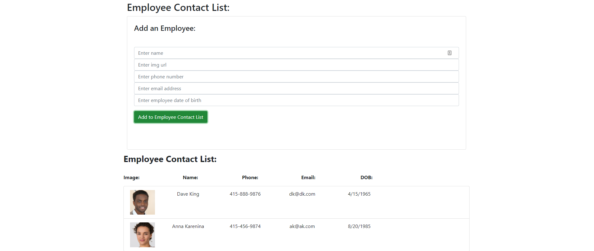

# Employee Contact Directory

## Summary

This application is a small react application that allows a manager or teammember to create a database table of their employees' or coworkers' contact information:



* [See Live Site](https://nameless-wildwood-28032.herokuapp.com/)

## Key Pieces of Code

The key to this application running is the use of a global state to track employees, add new employees, and sort the employees by their names.  In order to do this, we create a global state that can be used across components.

```
const EmployeeContext = createContext({
    id: "",
    name: "",
    img: "",
    phone: "",
    email: "",
    dob: ""
});

const { Provider } = EmployeeContext;
```

Once we have established the state, we need to be able to pass the information to our components without having to pass exact props:

```
<EmployeeProvider>
    <Header>
        <Form />
    </Header>
    <List />
</EmployeeProvider>
```


<hr>

## Built With

* [HTML](https://developer.mozilla.org/en-US/docs/Web/HTML)
* [CSS](https://developer.mozilla.org/en-US/docs/Web/CSS)
* [React](https://reactjs.org/)
* [Bootstraps](https://getbootstrap.com/)

## Licenses

 
The MIT License (MIT); Copyright 2011-2020 Twitter, Inc.; Copyright 2011-2020 The Bootstrap Authors

## Authors

### **Shaun Limbeek** 

- [Link to Github](https://github.com/slimbeek6/)
- [Link to LinkedIn](https://www.linkedin.com/in/shaun-limbeek/)
- [Link to Portfolio](https://afternoon-temple-06204.herokuapp.com/)